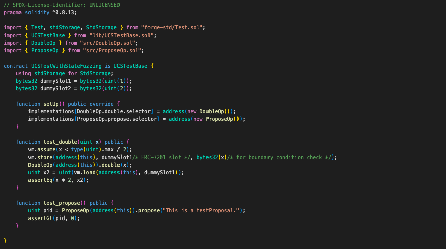
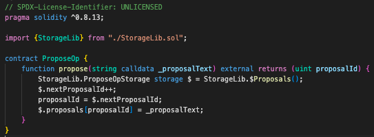
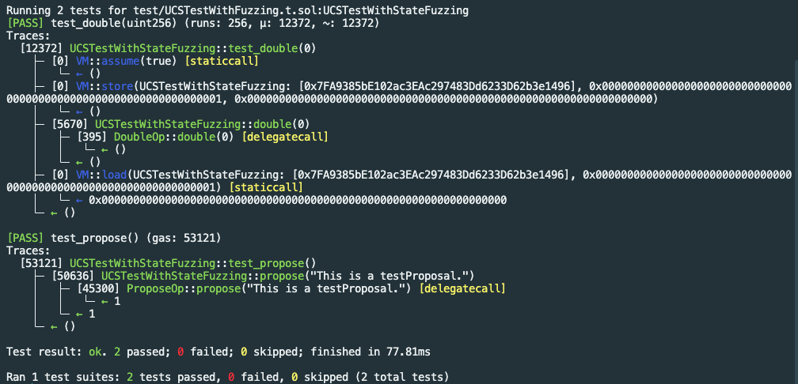

# ERC-7546 UCS TDD Example

## Overview
This project was born for solving unconfortable UUPS-based testing/devops experience.  

**The downside of UUPS testing are**
  - You must be proxy-concerned.
  - One-implementation, one proxy.
  - Hardhat.
  - "BigNumber"
  - Slow.
  - State preparation via complex scenario.

**The virtue of UCS testing are**
  - Just unit test functions.
  - No proxies within your sight.
  - Foundry.
  - Just simply write Solidity.
  - Fast.
  - Made up your state and run [fuzz testing](https://mirror.xyz/shogochiai.eth/qw8PutYbxhm3g8FaW9g4NjKq14giC8jVtq_aMFOvkSU).

## Status
- DoubleOp and ProposeOp test cases are demonstrated.

## Roadmap
- More example like "ve", "DAO", and "AA"

## Screenshots

