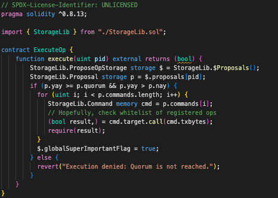
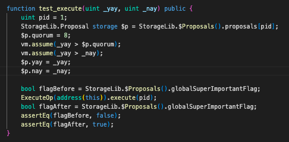
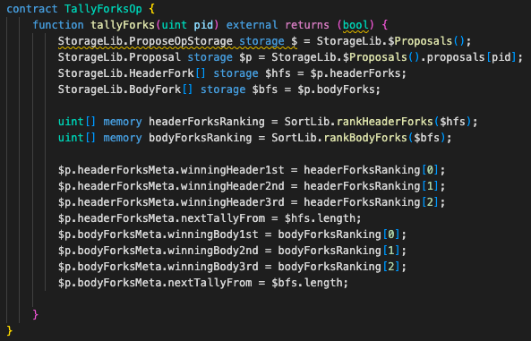

# ERC-7546 UCS TDD Example

## Overview
This project was born to solve unconfortable UUPS-based testing/devops experience.
[UCS](https://www.ecdysis.xyz/opensource/erc7546%3Aucs) is a reusable, maintainable, and testable design pattern for upgradeable smart contracts.

**The downside of UUPS testing are**
  - You must be proxy-concerned.
  - One-implementation, one proxy.
  - Hardhat.
  - "BigNumber"
  - Slow.
  - State preparation via complex scenario.

**The virtue of UCS testing are**
  - Just unit test functions.
  - No proxies within your sight.
  - Foundry.
  - Just simply write Solidity.
  - Fast.
  - [Fuzz-able state](https://mirror.xyz/shogochiai.eth/qw8PutYbxhm3g8FaW9g4NjKq14giC8jVtq_aMFOvkSU).
  - Each test case is loosely coupled, and changes will not be propagated.

## Status
- ProposeOp and MajorityVoteForProposal are sharing the same state. Functions can share their storage and you can treat UCS proxy as a singleton contract.
  
  
- The fuzz test of ExecuteProposalOp has "fuzzable" prerequisite state.
  
  
- TallyForksOp shows UCS is able to sustain several voting rule in a singleton contract. You can even upgrade and clone such DAO proxy.
  

## Roadmap
- More example like "ve" and "AA"
